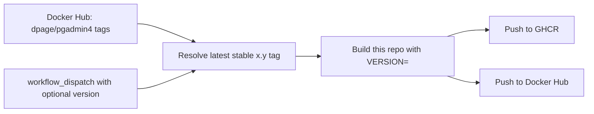

# pgadmin


> Thin delta. Least privilege. Upstream pgAdmin, repackaged for OpenShift-style clusters.

| Snapshot | Value |
| --- | --- |
| Upstream base | `dpage/pgadmin4:${VERSION}` |
| Primary goal | Keep pgAdmin close to upstream while removing a privilege that is awkward in restricted clusters |
| Image delta | Remove `/etc/sudoers.d/postfix` and clear `CAP_NET_BIND_SERVICE` from Python |
| Delivery model | Automatically track stable upstream releases and publish matching tags |

## Why this project exists

The official `dpage/pgadmin4` image is built to work across a broad range of container runtimes. OpenShift is stricter by design.

In a typical OpenShift deployment:

- containers run as an arbitrary non-root UID
- restricted Security Context Constraints (SCCs) aggressively drop Linux capabilities
- images that depend on embedded privilege are more likely to become brittle

The sharp edge here is `CAP_NET_BIND_SERVICE`.

That capability exists for one purpose: it lets a non-root process bind to ports below `1024`. Carrying that privilege on the Python interpreter may be acceptable in more permissive environments, but it is a poor fit for OpenShift-style hardening:

- it bakes extra privilege into the interpreter itself
- every Python process started from that binary inherits the ability to bind low ports
- restricted clusters often strip or block that privilege, which can turn into startup or permission issues
- OpenShift already expects network exposure to be handled by Services and Routes, so shipping extra bind-low-port privilege inside the image is usually unnecessary

This repository takes the smallest possible approach: keep the upstream pgAdmin release, remove the capability, and publish the result automatically.

## What changes from upstream

| Area | Upstream intent | This image |
| --- | --- | --- |
| Base image | Official `dpage/pgadmin4` release | Same upstream version |
| Low-port binding privilege | Python can carry `CAP_NET_BIND_SERVICE` for privileged-port binding | Capability is cleared with `setcap CAP_NET_BIND_SERVICE=-eip /usr/local/bin/python3.14` |
| Postfix sudoers drop-in | Present in the image | Removed with `rm -vf /etc/sudoers.d/postfix` |

The `setcap ... =-eip` form clears the capability from the file, so this image stays closer to the least-privilege model OpenShift expects.

## Dockerfile logic

```Dockerfile
ARG VERSION=9.16
FROM dpage/pgadmin4:${VERSION}

USER root
RUN rm -vf /etc/sudoers.d/postfix \
  && setcap CAP_NET_BIND_SERVICE=-eip /usr/local/bin/python3.14
USER pgadmin
```

The goal is intentionally narrow: no pgAdmin fork, no custom application patch stack, just a small repackaging layer that makes the upstream image friendlier to hardened clusters.

## Release automation



GitHub Actions handles the release loop end to end:

- runs daily at `03:23 UTC`
- can also be triggered manually with an optional `version` input
- looks for stable upstream tags matching `x.y`
- builds this repository with the same detected version
- publishes versioned images to both registries

## Published images

- `ghcr.io/fyannk/pgadmin:<version>`
- `docker.io/fyannk/pgadmin:<version>`

## When this image makes sense

- OpenShift clusters using restricted or restricted-v2 SCCs
- Kubernetes environments that strip extra Linux capabilities
- teams that want an auditable wrapper around upstream pgAdmin instead of a long-lived fork

## Project philosophy

One small, reviewable delta:

- stay on the official pgAdmin release stream
- remove the capability that causes friction in restricted environments
- automate publishing so the wrapper does not become a maintenance burden
